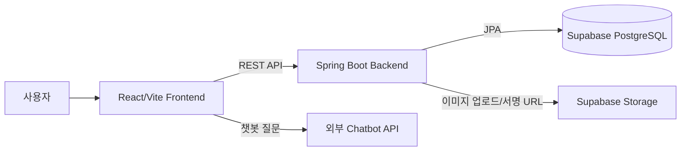
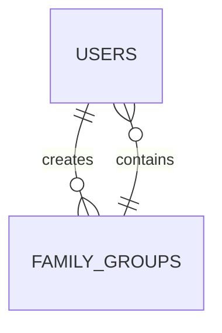
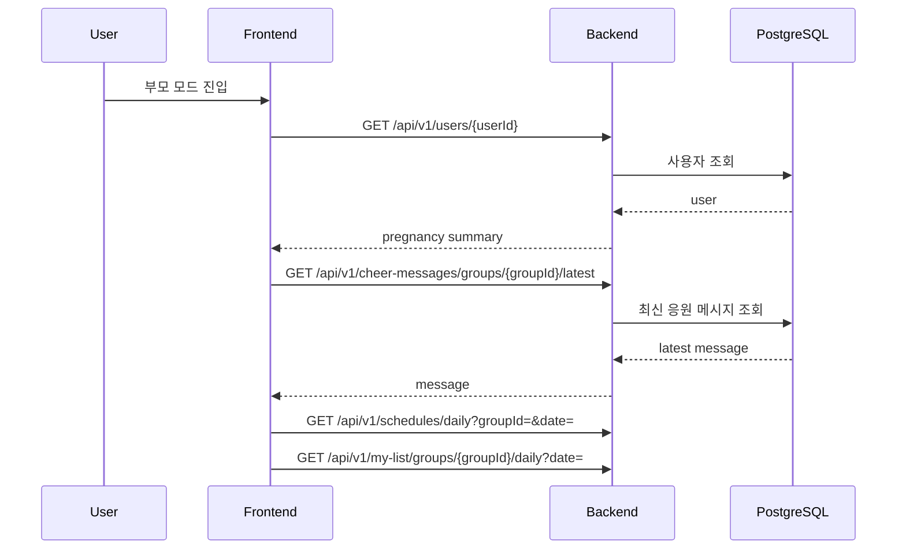
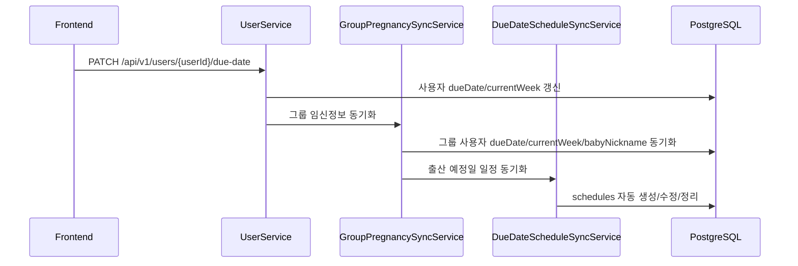
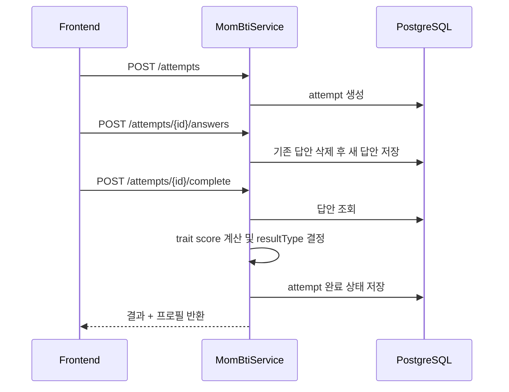

# LG ThinQ Parenting Mode 시스템 아키텍처 문서

## 1. 문서 목적

이 문서는 `LG ThinQ Parenting Mode` 프로젝트의 실제 소스 구조를 기준으로 시스템 아키텍처를 설명한다.
특히 다음 내용을 빠르게 파악할 수 있도록 정리했다.

- 프런트엔드와 백엔드의 프로젝트 분리 구조
- 사용자, 가족 그룹, 일정, MY LIST, MomBTI, 커뮤니티, 임신일기 중심의 도메인 구조
- 데이터 저장소(PostgreSQL/Supabase)와 외부 연동 지점
- 현재 구현 완료 영역과 데모/목업 기반 영역의 경계

---

## 2. 전체 구성 요약

현재 저장소는 크게 2개의 주 프로젝트와 1개의 보조 프런트 실험 영역으로 구성된다.

- `thinq-parent-frontend`
  - React 19 + Vite 기반 단일 페이지 프런트엔드
  - 부모 모드 UI, 일정 관리, MY, MomBTI, 커뮤니티, 임신일기 화면 포함
- `thinq-parent-backend`
  - Spring Boot 4 + Spring Web + Spring Data JPA 기반 REST API 서버
  - PostgreSQL(Supabase)와 연동
- `thinq-parent-frontend/chatbot`
  - 별도 CRA 기반 챗봇 실험 프로젝트
  - 메인 Vite 앱과는 독립적으로 존재

시스템은 "가족 그룹 단위의 임신/육아 지원 플랫폼"으로 설계되어 있으며, `users.group_id`를 기준으로 대부분의 기능이 그룹 컨텍스트 안에서 동작한다.

---

## 3. 상위 아키텍처



### 핵심 포인트

- 프런트엔드는 대부분 `fetch` 기반으로 백엔드 REST API를 직접 호출한다.
- 백엔드는 JPA 엔티티를 통해 PostgreSQL 테이블에 접근한다.
- 임신일기 이미지는 DB가 아니라 Supabase Storage에 저장하고, 메타데이터만 DB에 저장한다.
- 챗봇은 메인 백엔드를 거치지 않고 프런트에서 외부 Cloud Run API로 직접 호출한다.

---

## 4. 프로젝트 디렉터리 구조

```text
thinq-parent/
├─ thinq-parent-frontend/
│  ├─ src/
│  │  ├─ App.jsx
│  │  ├─ config/api.js
│  │  ├─ data/
│  │  └─ features/
│  │     ├─ parent/
│  │     ├─ my/
│  │     ├─ mombti/
│  │     ├─ community/
│  │     └─ diary/
│  ├─ assets/
│  └─ chatbot/
└─ thinq-parent-backend/
   ├─ src/main/java/com/example/thinq_parent/
   │  ├─ common/
   │  ├─ user/
   │  ├─ familygroup/
   │  ├─ schedule/
   │  ├─ mylist/
   │  ├─ todo/
   │  ├─ mombti/
   │  ├─ community/
   │  ├─ pregnancydiary/
   │  ├─ cheermessage/
   │  └─ health/
   ├─ src/main/resources/application.properties
   └─ supabase-postgres-schema.sql
```

---

## 5. 프런트엔드 아키텍처

## 5.1 기술 스택

- React 19
- Vite 7
- 기본 `fetch` API 사용
- 별도 라우터 없이 `App.jsx` 내부 상태 기반 화면 전환
- 일부 데이터는 `localStorage` 캐시 사용

## 5.2 프런트 구조 특징

프런트는 전형적인 라우팅 기반 SPA가 아니라, `App.jsx`에서 `currentScreen` 상태를 바꿔가며 화면을 전환하는 구조다.

### 화면 전환 방식

- `home`
- `parent-mode`
- `parent-mode-device`
- `parent-mode-schedule`
- `community`
- `my`
- `child-profile`
- `mombti-menu`
- `mombti-test`
- `mombti`
- `pregnancy-diary`
- `pregnancy-diary-write`

즉, 현재 아키텍처는 "모바일 앱 시뮬레이션형 단일 셸 UI"에 가깝다.

## 5.3 프런트 데이터 흐름

프런트는 아래 3가지 방식이 혼합되어 있다.

- 실API 호출
  - 사용자 정보
  - 일정
  - MY LIST
  - MomBTI
  - 응원 메시지
- 외부 API 직접 호출
  - 전문가 챗봇
- 목 데이터 사용
  - 일부 커뮤니티 화면
  - 일부 임신일기 화면
  - 일부 디바이스/홈 시연 UI

## 5.4 API 연결 방식

프런트의 기본 API 엔드포인트는 고정값으로 관리된다.

```text
API_BASE_URL = http://192.168.0.43:8081
```

이는 현재 개발 환경에서 같은 LAN 내부 모바일/PC 테스트를 염두에 둔 설정이다.

추가로 챗봇은 별도 엔드포인트를 사용한다.

```text
https://chatbot-api-338378601376.asia-northeast3.run.app/ask
```

## 5.5 로컬 캐시 전략

프런트는 사용자 경험을 위해 일부 화면 데이터에 `localStorage` 캐시를 둔다.

- 메인 홈의 일일 일정 캐시
- 부모 모드 일정 관리의 월간 일정 캐시

즉, 백엔드 응답 실패 시에도 일부 최근 상태를 UI에 유지하려는 구조다.

## 5.6 프런트 기능별 구현 상태

### 실API 연동이 비교적 잘 연결된 영역

- 사용자 조회/수정
- 출산 예정일 수정
- 아기 닉네임 수정
- 일간/월간 일정 조회
- 일정 생성/수정/삭제
- MY LIST 조회/생성/체크/수정/삭제
- MomBTI 시도 생성, 답안 제출, 완료 처리
- 최신 응원 메시지 조회

### 현재 목업/정적 데이터 비중이 큰 영역

- 커뮤니티 목록/필터/글쓰기 UI
- 임신일기 목록/작성 UI
- 일부 부모 모드 홈 카드
- 디바이스 루틴/가전육아 소개 화면

즉, 프런트는 "핵심 사용자 흐름 일부는 백엔드 연동 완료, 나머지는 시연 중심 UI" 상태로 보는 것이 정확하다.

---

## 6. 백엔드 아키텍처

## 6.1 기술 스택

- Java 21
- Spring Boot 4.0.3
- Spring Web
- Spring Data JPA
- Spring Validation
- Spring Security Crypto
- Springdoc OpenAPI
- PostgreSQL Driver

## 6.2 계층 구조

백엔드는 도메인별로 아래 계층을 반복하는 전형적인 구조다.

```text
Controller -> Service -> Repository -> Entity(Table)
```

공통 관심사는 `common` 패키지로 분리되어 있다.

- `common/api`
  - 공통 API 응답 래퍼 `ApiResponse`
- `common/config`
  - CORS, Swagger, PasswordEncoder, 시간 설정
- `common/exception`
  - 글로벌 예외 처리
- `common/validation`
  - 깨진 텍스트 방지용 검증기

## 6.3 공통 응답/예외 처리

모든 REST API는 대체로 아래 구조를 따른다.

```json
{
  "success": true,
  "message": "...",
  "data": { }
}
```

예외는 `GlobalExceptionHandler`에서 일괄 처리하며, 다음 상황을 명확히 분리한다.

- `404 Not Found`
- `409 Conflict`
- `400 Bad Request`
- `500 Internal Server Error`

## 6.4 CORS 정책

백엔드는 `/api/**` 경로에 대해 로컬 및 사설망 대역에서의 호출을 허용한다.

- `localhost`
- `127.0.0.1`
- `192.168.x.x`
- `10.x.x.x`
- `172.16.x.x ~ 172.31.x.x`

즉, PC 브라우저와 동일 LAN 내 모바일 시연 환경을 고려한 개발 친화형 설정이다.

---

## 7. 핵심 도메인 아키텍처

## 7.1 사용자와 가족 그룹

이 시스템의 중심은 `User`와 `FamilyGroup`이다.



실제 모델에서는 `family_groups.user_id`가 그룹 생성자 역할을 가지며, 각 사용자는 `users.group_id`로 그룹에 소속된다.

### 주요 역할

- 사용자 생성
- 가족 그룹 생성
- 초대 코드 기반 그룹 참여
- 그룹 내 임신 정보 동기화

### 중요한 비즈니스 규칙

- `USER` 역할 계정만 가족 그룹 생성 가능
- 한 사용자는 하나의 그룹에만 속할 수 있음
- 그룹 생성/참여 후 그룹 내 사용자들의 임신 정보가 동기화됨

## 7.2 임신 정보 동기화

이 프로젝트에서 가장 중요한 도메인 규칙 중 하나는 "가족 그룹 내 임신 정보 공유"다.

`GroupPregnancySyncService`가 아래 데이터를 그룹 전체에 동기화한다.

- `babyNickname`
- `dueDate`
- `currentWeek`

그리고 출산 예정일이 변경되면 `DueDateScheduleSyncService`가 그룹 캘린더에 자동 일정도 동기화한다.

### 자동 생성되는 일정

- 제목: `출산 예정일`
- 유형: `중요`
- 날짜: 사용자 due date

이 일정은 수동 수정/삭제가 제한된다.

## 7.3 일정 관리

일정은 `schedules` 테이블을 중심으로 동작한다.

### 특징

- 그룹 단위 조회
- 월간 조회
- 일간 조회
- 일정 생성/수정/삭제
- 추천 TODO를 일정으로 변환 가능

### 일정 타입

- 아기
- 가족
- 일
- 개인
- 중요
- 기타

프런트의 캘린더 UI는 이 타입별 색상을 직접 매핑해 시각적으로 구분한다.

## 7.4 TODO / MY LIST

TODO 관련 도메인은 3단계로 나뉜다.

- `todos`
  - 주차 기반 추천 TODO 마스터 데이터
- `recommand_list`
  - 추천 TODO의 사용자/그룹 체크 상태
- `my_list`
  - 사용자가 직접 추가하는 개인/그룹 할 일

현재 프런트에서 핵심적으로 사용하는 것은 `my_list`이며, 부모 모드의 TO DO와 MY 화면에서 소비된다.

## 7.5 MomBTI

MomBTI는 비교적 완성도 높은 독립 도메인으로 구성되어 있다.

### 주요 테이블

- `mombti_question`
- `mombti_choice`
- `mombti_test_attempt`
- `mombti_answer`
- `mombti_result_profile`

### 처리 흐름

1. 프런트가 테스트 시작 시 `attempt` 생성
2. 문항별 선택 결과를 답안 목록으로 제출
3. 완료 시 서버가 trait 점수를 계산
4. `P/R`, `T/F`, `I/C`, `E/M` 비교로 최종 타입 생성
5. 결과 프로필을 조회해 응답

즉, MomBTI는 프런트 단순 계산이 아니라 서버가 점수 산정과 최종 타입 결정을 책임지는 구조다.

## 7.6 커뮤니티

커뮤니티 도메인은 백엔드 기준으로는 꽤 정교하게 설계되어 있다.

### 주요 테이블

- `boards`
- `community_keywords`
- `community_posts`
- `community_comments`
- `community_post_likes`

### 지원 기능

- 게시판/키워드 메타 조회
- 게시글 목록/상세
- 게시글 작성/수정/삭제
- 댓글 작성/수정/삭제
- 좋아요/좋아요 취소
- MomBTI 동일 유형 글 필터링

### 특징

- 게시글 작성 시 작성자의 최신 MomBTI 결과를 저장
- `sameMombtiOnly=true` 요청 시 동일 MomBTI 유형 글만 조회 가능
- 게시글/댓글은 하드 삭제가 아니라 상태값 기반 소프트 삭제

현재 프런트 커뮤니티 화면은 아직 이 API를 본격 소비하지 않고, 시연용 정적 데이터 중심으로 동작한다.

## 7.7 임신일기

임신일기는 DB와 Storage를 함께 사용하는 대표 기능이다.

### 저장 구조

- 텍스트/메타데이터: PostgreSQL
- 이미지 파일: Supabase Storage
- 이미지 메타데이터: `pregnancy_diary_images`

### 기능

- 목록 조회
- 상세 조회
- 이미지 업로드
- 작성
- 수정
- 삭제
- 이미지 개별 삭제

### 특징

- 같은 그룹 내 사용자끼리 일기 열람 가능
- 작성자 여부(`isMine`)를 응답에 포함
- 썸네일 개념 존재
- 이미지 URL은 public bucket 또는 signed URL 방식으로 반환

현재 프런트의 임신일기 화면은 정적 목업 비중이 높지만, 백엔드 API는 실서비스형 구조에 가깝다.

## 7.8 응원 메시지

응원 메시지는 그룹 기반의 가벼운 소셜 기능이다.

- 메시지 작성
- 그룹 기준 최신 메시지 조회

부모 모드 홈 화면에서 최신 응원 메시지를 가져와 노출한다.

---

## 8. 데이터 저장소 구조

## 8.1 메인 DB

메인 DB는 Supabase PostgreSQL을 사용한다.

### 특징

- JPA `ddl-auto=validate`
- 즉, 애플리케이션이 스키마를 생성하지 않고 기존 스키마를 검증
- 운영/시연 DB 스키마를 명시적으로 관리하는 방식

## 8.2 스키마 관점의 도메인 분류

### 사용자/가족

- `users`
- `family_groups`

### 부모 모드 일정/할 일

- `schedules`
- `todos`
- `my_list`
- `recommand_list`

### MomBTI

- `mombti_question`
- `mombti_choice`
- `mombti_test_attempt`
- `mombti_answer`
- `mombti_result_profile`

### 커뮤니티

- `boards`
- `community_keywords`
- `community_posts`
- `community_comments`
- `community_post_likes`

### 임신일기

- `pregnancy_diaries`
- `pregnancy_diary_images`

### 기타

- `cheer_messages`
- `home_appliances`
- `appliance_routines`
- `ai_chat_logs`

마지막 3개 영역은 스키마에는 존재하지만, 현재 Java 백엔드 도메인/컨트롤러 구현은 아직 연결되지 않았다.

---

## 9. 주요 시퀀스 흐름

## 9.1 부모 모드 홈 진입



## 9.2 출산 예정일 수정



## 9.3 MomBTI 완료



---

## 10. 현재 구현 범위 평가

## 10.1 강하게 연결된 핵심 축

- 사용자 정보 관리
- 가족 그룹 기반 데이터 모델
- 일정 관리
- MY LIST
- MomBTI
- 응원 메시지
- 임신일기 백엔드

## 10.2 프런트-백엔드 연결이 부분적인 영역

- 커뮤니티
- 임신일기 프런트
- 가전육아/루틴

즉, 현재 시스템은 "부모 모드 핵심 데이터 흐름은 살아 있고, 일부 서비스 화면은 데모 UX 중심으로 확장 중인 상태"로 해석할 수 있다.

---

## 11. 아키텍처상 장점

- 도메인 기준 백엔드 패키지 분리가 명확하다.
- 가족 그룹 중심의 데이터 경계가 일관적이다.
- 출산 예정일 변경 시 그룹 정보와 일정이 자동 동기화된다.
- MomBTI가 독립 서비스처럼 설계되어 재사용과 확장이 쉽다.
- 임신일기에서 DB와 파일 스토리지를 분리해 확장성을 확보했다.
- Swagger/OpenAPI가 있어 프런트 연동 문서화에 유리하다.

---

## 12. 현재 구조에서 확인되는 한계와 유의점

- 프런트 라우팅이 상태 기반이라 화면 수가 더 늘어나면 유지보수 비용이 커질 수 있다.
- `API_BASE_URL`이 코드에 하드코딩되어 있어 환경별 배포 전환에 취약하다.
- 커뮤니티/임신일기 프런트는 백엔드 API와 아직 완전히 연결되지 않았다.
- 일부 프런트 파일은 한글 인코딩 깨짐 흔적이 있어 유지보수 시 주의가 필요하다.
- Supabase Storage 업로드는 `service-role-key`가 비어 있으면 동작하지 않는다.
- 스키마에는 `home_appliances`, `appliance_routines`, `ai_chat_logs`가 있으나 백엔드 구현은 아직 없다.

---

## 13. 향후 확장 권장 방향

### 1) 프런트 API 계층 분리

현재 `fetch` 호출이 화면 컴포넌트 내부에 분산되어 있으므로, 기능별 API 모듈을 분리하면 유지보수가 쉬워진다.

### 2) 환경설정 외부화

- `API_BASE_URL`
- 챗봇 URL
- 사용자 기본 ID

등을 `.env`로 이동하면 시연/개발/배포 환경 전환이 쉬워진다.

### 3) 커뮤니티/임신일기 프런트 실API 전환

백엔드는 이미 충분히 준비되어 있으므로, 프런트만 붙이면 사용자 흐름 완성도가 크게 올라간다.

### 4) 가전육아 도메인 백엔드 구현

스키마에 준비된 `home_appliances`, `appliance_routines`를 API로 노출하면 "LG ThinQ Parenting Mode"의 제품 정체성이 더 강해질 수 있다.

### 5) 인증/권한 모델 보강

현재 구조는 사용자 ID를 프런트에서 직접 넘기는 방식이 많아 보이므로, 추후 로그인 토큰 기반 인증 계층을 넣는 것이 바람직하다.

---

## 14. 결론

이 프로젝트는 단순 UI 목업을 넘어서, 이미 `가족 그룹 기반 임신/육아 지원 서비스`로서의 핵심 백엔드 도메인과 데이터 모델을 갖춘 상태다.

특히 아래 3개 축이 아키텍처의 중심이다.

- 그룹 단위 임신 정보 동기화
- 일정/MY LIST 중심의 부모 모드 운영 기능
- MomBTI, 커뮤니티, 임신일기로 확장되는 정서적 지원 기능

현재 프런트는 일부 영역에서 목업과 실API가 혼재하지만, 백엔드 구조 자체는 실서비스 확장을 염두에 둔 형태로 잘 정리되어 있다.
